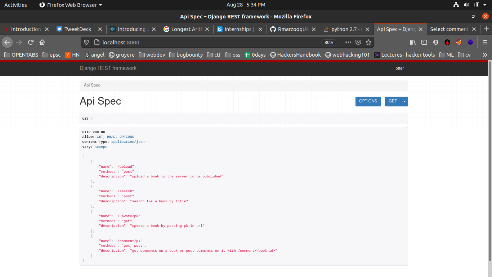
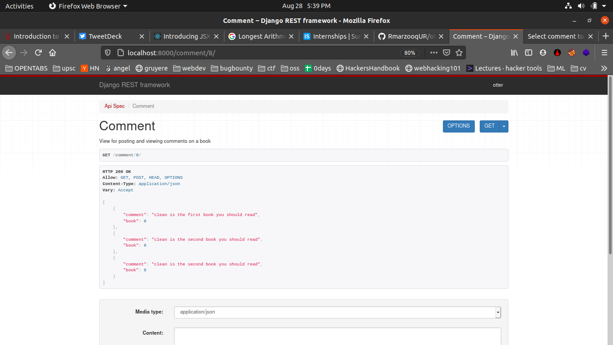
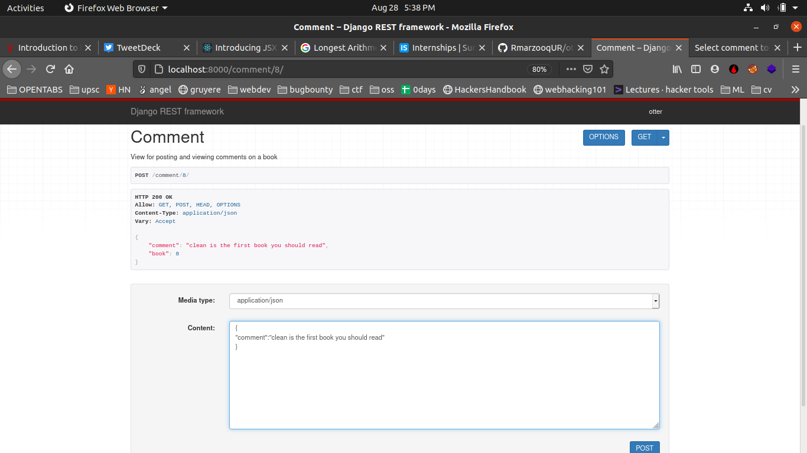
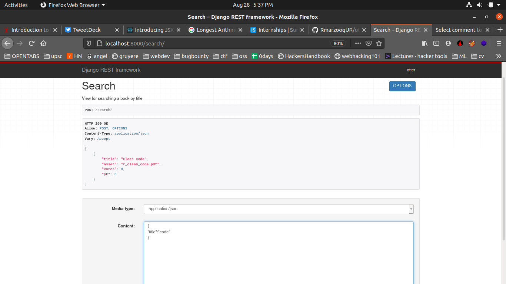
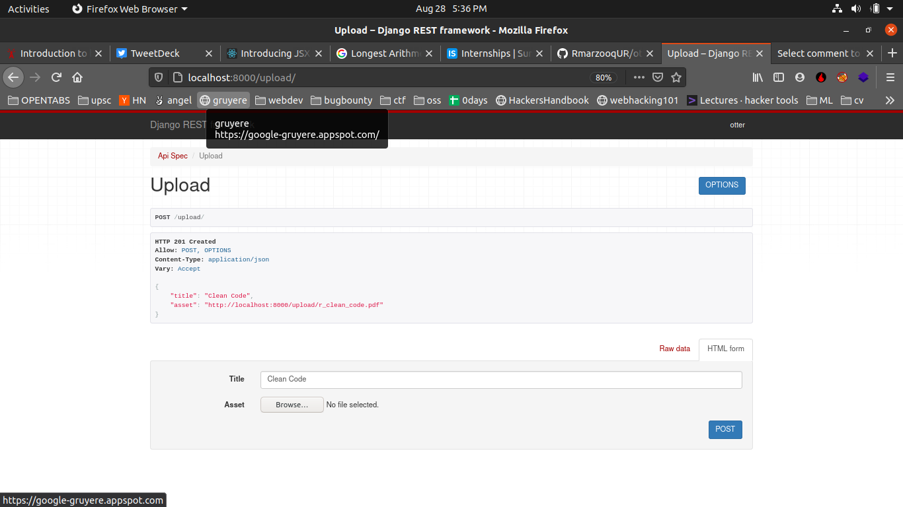
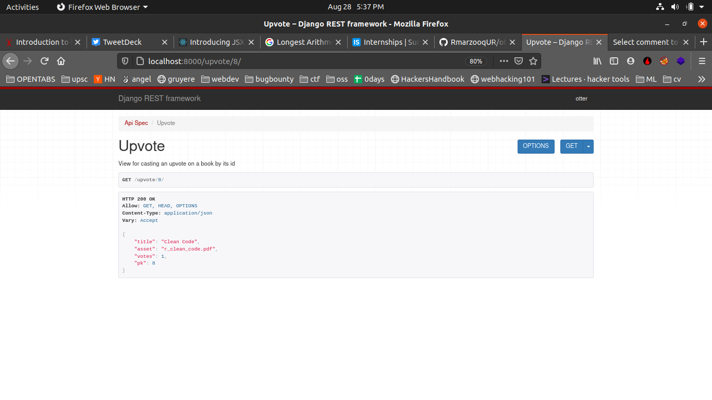

# setup

## Create virtual environment
- `virtualenv .venv`
- `source .venv/bin/activate`

## Install Requirements
`pip install requirements.txt`

 ## run
 - `python manage.py migrate`
 - `python manage.py runserver`

 ## api spec

